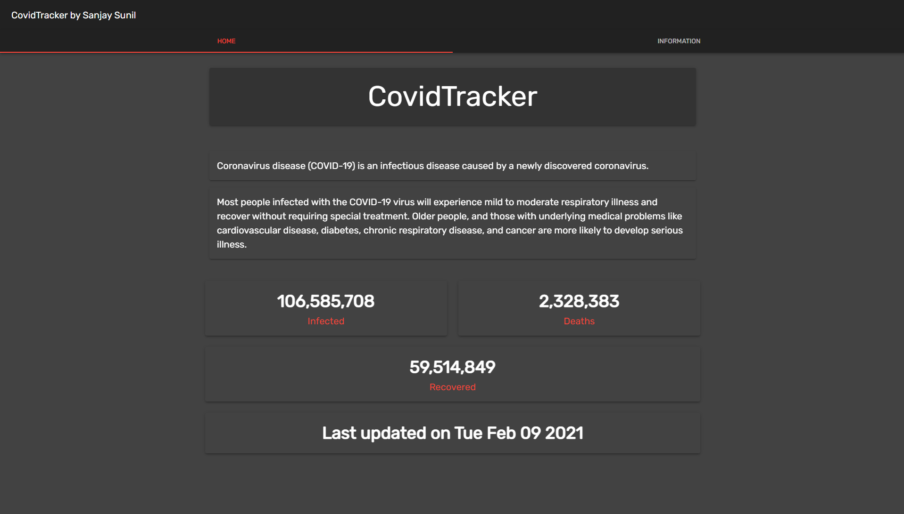

<!-- Logo -->
<p align="center">
  <a href="https://github.com/sanjaysunil/covidtracker">
  </a>
</p>

<!-- Title -->
<h1 align="center">CovidTracker</h1>
  <p align="center">
    An awesome Covid Tracking application with real statistics on Covid19!
    <br />
    <a href="https://github.com/SanjaySunil/CovidTracker/issues/new?assignees=&labels=Bug&template=bug_report.md&title=%5BBUG%5D">Report Bug</a>
    ·
    <a href="https://github.com/SanjaySunil/CovidTracker/issues/new?assignees=&labels=Suggestions&template=suggestions.md&title=%5BSUGGESTION%5D">Request Feature</a>
  </p>
</h1>
<br/><br/>

<!-- Preview -->
<p align="center">
  <a href="">
    
  </a>
  <!-- Drop Shadow -->
  <a href="">
    
  </a>
</p>
<br/>

<!-- Information -->

## What's CovidTracker?

<a href="https://github.com/sanjaysunil/covidtracker">CovidTracker</a> is a basic React application that provides you with worldwide data including deaths, cases and recovered cases.
<br/>

<!-- Installation -->

### Installation

1. Clone CovidTracker

```sh
git clone https://github.com/sanjaysunil/covidtracker
```

2. Install node_modules

```sh
npm install
```

3. Start application!

```sh
npm start
```

<br/>

<!-- ROADMAP -->

## Roadmap

See the [open issues](https://github.com/SanjaySunil/covidtracker/issues) for a list of proposed features (and known issues).
<br/>

<!-- CONTRIBUTING -->

## Contributing

Contributions are what make the open source community such an amazing place to be learn, inspire, and create. Any contributions you make are **greatly appreciated**.

1. Fork the Project
2. Create your Feature Branch (`git checkout -b feature/Feature`)
3. Commit your Changes (`git commit -m 'Added a new Feature'`)
4. Push to the Branch (`git push origin feature/Feature`)
5. Open a Pull Request
<br/>

## License

Copyright © 2021 Sanjay Sunil (sanjaysunil@protonmail.com)

Distributed under the MIT License. See `LICENSE` for more information.
